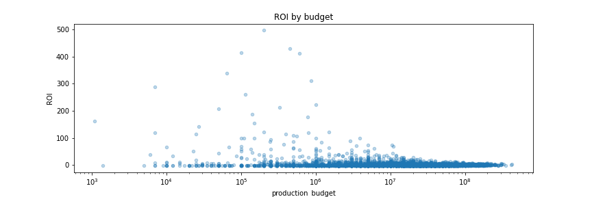
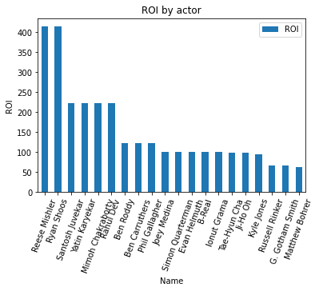

# Overview
 
from upsplash.com
The film industry is big. And some films have big box offices, such as Avatar. Some films may not seem big but with small investments, yielded significant profits compared to the investment, like The Gallows. There are many factors that can affect investment outcomes, such as politics, time of year, and the economy. More in films themselves, there are *factors* like **Budget, Director/Actor, and Genre**.  

# Business Understanding
Microsoft wants to invest in the film industry. Here I use **Return on Investment**(or ROI) as a measurement to determine if the film is worth to invest. **Budget, Director/Actor, and Genre** were investigated here to see how different values of them can affect ROI. At end of the project, recommendations are provided on how to choose between these 3 selections in order to yield a high **ROI**. However, these recommendations are just recommendations, final decisions have to be made based on the real situation. 
 
# Data Understanding
There are 5 *csv files*(including tsv files) and 1 *sqlite database*. 

*movie_budgets.csv* contains information about **budgets** and **worldwide_gross**, which were used to calculate **ROI**. 

In sqlite3 database, there are four tables *movie_basics*,*movie_akas*,*persons*,*principals*. These tables contain information about directors, actors, and actresses, including their names. Also, movie titles have primary titles, original titles and aka titles, which are used to connect to *movie_budgets.csv*, so we can get the ROI for each **category(directors, actors, actresses)**. In the meantime, we also can get the ROI for each **genre**.

# Data Preparation
Data can be aquired here:
https://github.com/learn-co-curriculum/dsc-phase-1-project-v2-4/tree/master/zippedData

Copy files to `data` folder in project
## Table previews
Table **previews** are shown below to give a brief peep into data that will be worked on.

# Exploratory Data Analysis
### Budgets

1. Most films have an ROI below 50. 

2. When **budget** is *between* 10K to 1M, films have *higher* chance to achieve higher ROI, especially when budget are *between* 100K to 1M.

3. There are many films that have **budget** *between* 1M to 10M, but they can't achieve an ROI of more than 100. Then budgets *higher* than 10M lead to *much lower* ROI overall.

4. There are a few films that have **budget** *between* 1K to 10K, but ROI in this **budget** range can be very high or low, which means having a big variance. 

My **recommendation** is to have **budget** set *between* 100K to 200K to have a better chance to have a high return on investment. 
### Director/Actor



These show *the top 20* **actors, directors, and actresses** from the above graphs. However this result is strongly *correlated* with the specific **films** they are in. As top 1 and top 2 in each category, Reese Mishler, Cassidy Gifford, Travis Cluff, Chris Lofing, Pfeifer Brown, and Ryan Shoos all are part of *the same* film. 

I recommend picking the top 10 personas from each category since these persons have significantly higher ROI than the rest person.
### Genre

1. *' Adventure, Animation, Comedy, 'Action, Adventure, Sci-Fi',' Action, Adventure, Fantasy* are there **genres** that generate *the most* **ROI** compared to other **genres** or genre combinations. 

2. However overall each **genres** tends to have smilar **ROI** based on median comparison.

3. *Drama* has many *high* **ROI** films, however it could be the results of *high records volumns*. And a majority of drama films have *a negative* **ROI**. 

4. *Comedy* and *Documentary* have many films that has *high* **ROI**. 

I would *recommend* setting the genre as adventure and action or comedy since films yield high **ROI** are in these genres or a combination of these genres. 
# Results
## Recommendation 
This Analysis generates 3 recommendations:
1. Have **budget** set *between* 100K to 200K to have a better chance to have a high return on investment. 
2. Pick the top 10 personas from each category such as Reese Mishler, Cassidy Gifford, Travis Cluff, Chris Lofing, Pfeifer Brown, and Ryan Shoos, since these persons have significantly higher **ROI** than the rest person.
3. Set genre as adventure and action or comedy, since films yield high **ROI** are in these genres or a combination of these genres.
## More
There are some more related finds:
1. Another *measurement* here can be film **rating**, while it would provide perspective about how people like the film, ratings might not give as many insights about profit as **ROI** does.  

2. There are many **Genres** that don't have many records. However, those not-well-produced **genres** have some films that yield high ROI. These films can be investigated further and out of this project's scope.

3. The impact of persons on films'ROI is so correlated to films themselves. If there a group of people is in the same film and that film has a high **ROI** then those people all have a high **ROI**. So alternatively, we can investigate **ROI** for each **title**, and then choose the person from the top 10 films that have the highest ROI. 

4. Avatar has a big box office, however, its budget is so high that makes it is not high in ROI.


# More Information
Link to my Jupiter notebook
https://github.com/foxshakeitoff/MicroSoft_Movie_Analysis/blob/main/Notebook.ipynb
Link of my presentation.pdf
https://github.com/foxshakeitoff/MicroSoft_Movie_Analysis/blob/main/Presentation.pdf
## Repository Structure
```
├── images
├── README.md
├── Presentation.pdf
└── Notebook.ipynb
```


